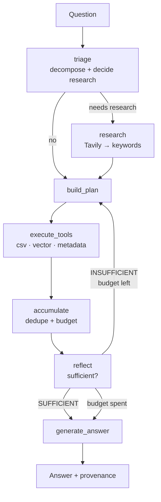

# Agentic RAG over Aircraft Maintenance Clusters

A planner-driven RAG system that answers questions about **230,573 aircraft maintenance work-order records**, organised into 51 issue *clusters* across 17 *parent groups*.

Instead of routing each question to a single retrieval method, a planner decomposes it into an evidence plan, runs several retrieval tools, accumulates evidence with provenance, and loops through a reflection judge until the evidence is sufficient.

**Everything runs locally.** The LLM is Ollama (`qwen3:8b`), embeddings are HuggingFace sentence-transformers, and the vector store is on-disk Chroma. No cloud LLM or embedding provider is involved. The only optional network call is Tavily research, which is strictly contained (see [Web research](#web-research-optional)).

---

## Quickstart

Requires Python 3.14 and [Ollama](https://ollama.com).

> **This repository is private.** `data/` contains real maintenance records — aircraft registrations, timestamps, and per-tail fault counts in the cluster documents. Keep it private, and do not redistribute the contents. `.env` is gitignored so API keys stay out of history; use `.env.example` as the template.

From a clean checkout:

```bash
# 1. Install dependencies
cd gpt_rags
python -m venv .gpt_rags
source .gpt_rags/bin/activate          # Windows: .gpt_rags\Scripts\activate
pip install -r requirements.txt

# 2. Get the local model
ollama pull qwen3:8b

# 3. Configure
cat > .env <<'EOF'
OLLAMA_MODEL=qwen3:8b
OLLAMA_BASE_URL=http://localhost:11434
EMBEDDING_MODEL=sentence-transformers/all-MiniLM-L6-v2
EOF
```

**4. Start Ollama in a second terminal** — it blocks, so it needs its own window:

```bash
ollama serve
```

Back in the first terminal:

```bash
# 5. Build the vector index — the rm is mandatory, ingest appends
rm -rf chroma_db && python ingest.py

# 6. Run it
python main.py
```

Then ask questions at the prompt; type `exit` or `quit` to stop.

```
Ask a question: How many records are in cluster c_22?

[plan] csv_lookup (c_22): What is the total number of records associated with cluster c_22?
[execute] csv_lookup returned 1 item(s)

--- Final Answer ---
The number of records in cluster c_22 is **1609**, as indicated by the evidence
from the file `data/final_joined_output.csv`.

--- Debug Info ---
Retrieval passes: 1
Evidence items: 1 via ['csv_lookup']
Sources: ['data/final_joined_output.csv']
Verdict: SUFFICIENT
```

**Already set up?** Every later session is just `ollama serve` in one terminal, and in another:

```bash
cd gpt_rags && source .gpt_rags/bin/activate
python main.py
```

You only need to re-run `rm -rf chroma_db && python ingest.py` if you change something in `data/`.

**If something goes wrong:**

| Symptom | Fix |
|---|---|
| `could not connect to ollama server` | Start `ollama serve` in another terminal |
| `model "qwen3:8b" not found` | `ollama pull qwen3:8b` |
| `Cluster taxonomy not found` / `CSV knowledge base not found` | Run from the repo root — paths in `.env` are relative |
| Answers cite unrelated clusters | The index is stale or doubled: `rm -rf chroma_db && python ingest.py` |
| Startup pauses on `Loading model...` | Expected — the embedding model, a 46MB CSV and the ~5.6GB LLM load once, before the prompt |
| Answers feel slow | Lower `MAX_EVIDENCE_CHARS` and `OLLAMA_NUM_PREDICT` in `.env`; see [Configuration](#configuration) |

---

## How it works



### The three retrieval tools

| Tool | Backed by | Answers |
|---|---|---|
| `csv_lookup` | `final_joined_output.csv` | Counts, totals, raw records, work orders, registrations, ATA codes, schema |
| `vector_search` | Chroma, metadata-scoped | Cluster meaning, patterns, symptoms, corrective actions, comparisons |
| `metadata_search` | `cluster_taxonomy.csv` + Chroma | Which clusters belong to a group, group-level documents |

### Design decisions worth knowing

**The planner is a constrained selector, not a generator.** It picks a tool from a fixed enum and *names* entities — it never writes a retrieval query. Every entity it names is validated against the taxonomy, so a hallucinated cluster ID is dropped before it can reach a tool. This is what makes an 8B model safe to plan with.

**A deterministic plan is always the floor.** Keyword and taxonomy matching produce a plan before the LLM is called. If the model errors or returns nothing valid, that plan runs instead — the system can never be worse than plain keyword routing.

**Metadata scoping prevents cluster substitution.** Each chunk is tagged with its `cluster`, `parent`, and `doc_type` at ingest, so a search scoped to `c_38` physically cannot return `c_37`'s document. Both the reflection and answer prompts also forbid substituting a similar cluster, and `reflect` enforces it deterministically before spending an LLM call.

**The loop is bounded.** Two replans (three passes) by default. On exhaustion the answer is generated in *partial* mode: answer what the evidence supports, then state plainly what is missing.

---

## Setup

The [Quickstart](#quickstart) above is the full install. A few details worth knowing when you deviate from it.

**Rebuilding the index.** `ingest.py` reads `data/`, splits into 348 chunks, tags each with its `cluster`/`parent`/`doc_type`, and writes to `chroma_db/`. It uses `Chroma.from_documents`, which **appends** — always delete `chroma_db/` first, or every document is indexed twice and answers start citing duplicates.

```bash
rm -rf chroma_db && python ingest.py
```

It accepts `--data-dir --db-dir --chunk-size --chunk-overlap --embedding-model` if you need to build a variant index. Changing the embedding model requires a full rebuild — query-time and ingest-time embeddings must match or retrieval silently returns garbage.

**Enabling web research.** Add `TAVILY_API_KEY=...` to `.env`. Nothing else changes; see [Web research](#web-research-optional) for what it is and is not allowed to do.

---

## Usage

```bash
python main.py
```

Ask questions at the prompt; `exit` or `quit` to stop. Startup loads the embedding model, a 46MB CSV, and the ~5.6GB LLM — expect ~30s before the prompt appears, then **~15-25s** for a simple question and **~40s** for a multi-step one.

### Questions that work well

**Exact structured facts** — deterministic, no hallucination surface:
```
How many records are in cluster c_30?
How many clusters are there?
Show me records for cluster c_44
What is work order 1112782?
Show records for registration N556ND
Find records where the problem contains "mag drop"
```

**Cluster meaning:**
```
What is cluster c_30?
Explain cluster c_12
```

**Group-level synthesis** — fans out into several scoped searches:
```
What are common problem patterns across baffle clusters?
Summarize the ignition clusters
What corrective actions are common in the flight control group?
```

**Comparisons** — one retrieval per side, so neither crowds the other:
```
Compare c_30 and c_39
What is the difference between the cowling and baffle clusters?
```

The groups with the most material behind them are `inspection` (93k records), `flight_control` (15k across 5 clusters), `appearance_cleaning` (13k), `ignition` (9k), `landing_gear_tire` (8k), `cowling` (6k) and `pilot_reported` (6k). The `baffle` group has the richest *documents* — 10 clusters, 71 chunks — which makes it the best target for pattern questions.

### Reading the debug output

Every answer is followed by its plan and provenance:

| Line | Means |
|---|---|
| `Steps executed` | More than 1 means several tools genuinely contributed |
| `Evidence items: N via [...]` | Which tools produced the evidence |
| `Sources` | The real files behind the answer — if these look unrelated, distrust the answer |
| `Retrieval passes` | `1` is a clean hit; `2`–`3` means it replanned after judging the first attempt insufficient |
| `Verdict` / `Gaps` | `SUFFICIENT`, or what it could not find |

---

## Web research (optional)

Tavily can supply domain vocabulary to improve *planning*. It is deliberately boxed in:

- Runs only when triage requests it **and** `TAVILY_API_KEY` is set **and** `ENABLE_WEB_RESEARCH` is not false.
- The only thing that leaves `research.py` is a bounded list of short keywords — never prose, claims, or URLs.
- Those keywords reach the planner prompt and vector queries. **They can never reach the answer.** The guarantee is structural: `build_answer_prompt` and `build_reflection_prompt` accept only `(question, evidence)`, so there is no parameter through which research could arrive. Tests assert this.
- Every failure path is non-fatal — a missing key, missing package, or API error yields an empty list and the run continues locally.

To enable it, add `TAVILY_API_KEY=...` to `.env`. Nothing else changes — see `.env.example`.

Verified against live search: for *"What is a sniffler valve and which cluster covers it?"*, research produced 12 keywords, 7 of which appeared nowhere in the question or the retrieved evidence. None of those 7 reached the answer, which cited only local files. `test_workflow.py` runs this check whenever a key is present.

> `.env` is gitignored because it holds this key. If you fork or share the repo, distribute `.env.example` instead.

---

## Testing

```bash
python test_workflow.py      # 33 checks: 23 offline, 4 live, 6 web research
python test_csv_lookup.py    # CSV layer smoke checks
```

Both are plain print/assert scripts, not pytest, and nothing runs them automatically.

The suite degrades gracefully: the 20 offline checks need nothing, the 4 live checks skip without Ollama, and the 6 web-research checks skip without `TAVILY_API_KEY`.

Covered: taxonomy and plan validation, hallucinated-entity rejection, the deterministic planner across all five question shapes, research containment (both structurally and end-to-end against live search results), and four end-to-end questions.

Not yet covered: the replan loop (every live test hits SUFFICIENT on the first pass), the accumulator's dedupe/budget logic, `ingest.metadata_for()`, and `retriever.build_filter()` — these were verified manually but are not encoded as tests.

---

## Project layout

```
main.py          CLI loop and debug output
graph.py         LangGraph topology
nodes.py         Thin nodes + prompt builders
graph_state.py   State contract (EvidenceItem, PlanStep)
planner.py       Schemas, triage, plan building, validation
research.py      Tavily contract (self-contained)
tools.py         The three retrieval tool dispatchers
taxonomy.py      Single source of truth for clusters and groups
csv_lookup.py    Structured record queries
retriever.py     Chroma + metadata filtering
ingest.py        Loading, chunking, metadata enrichment, indexing
llm.py           Local model factory
```

`data/` holds one document per cluster (`cluster_c_<n>.txt`), whole-group documents (`cluster_<group>_unspecified.txt`), the record-level `final_joined_output.csv`, and `cluster_taxonomy.csv`. `chroma_db/` is generated and fully rebuildable from `data/`.

### Configuration

All settings in `config.py` are environment-overridable. The ones you're most likely to touch:

| Variable | Default | Purpose |
|---|---|---|
| `OLLAMA_MODEL` | `qwen3:8b` | Local chat model |
| `OLLAMA_NUM_CTX` | `8192` | Context window — must exceed a full evidence prompt |
| `OLLAMA_NUM_PREDICT` | `700` | Answer length cap — uncapped, the model writes 4000-token essays |
| `RETRIEVAL_K` | `8` | Documents per vector search — multiplies across plan steps |
| `MAX_ITERATIONS` | `2` | Replans allowed after the first pass |
| `MAX_PLAN_STEPS` | `4` | Tool calls per plan |
| `MAX_EVIDENCE_CHARS` | `8000` | Evidence budget — bounds both context use and latency |
| `TAVILY_API_KEY` | *(unset)* | Enables web research when present |

> Ollama defaults `num_ctx` to 4096, which is smaller than a full evidence prompt. Left at the default, prompts are silently truncated and the judge grades evidence it never saw. If you raise `MAX_EVIDENCE_CHARS`, raise `OLLAMA_NUM_CTX` with it.

> The embedding model at query time **must** match the one used at ingest, or retrieval silently returns garbage. Change `EMBEDDING_MODEL` only alongside a full re-ingest.

---

## Known limitations

- **`c_38` (sniffler valve) and `c_50` (spoiler)** exist in the taxonomy but have zero documents and zero records. Questions about them return the definition and state that no records exist — a data gap, not a bug.
- **ATA codes only match 4 digits.** `ATA 3240` works; `ATA 520` does not — the extractor regex is `\d{4}`.
- **~15-40s per question** on an M4 — four sequential local LLM calls (triage, plan, reflect, answer). Two settings dominate: `OLLAMA_NUM_PREDICT` caps generation (~26 tok/s), and prompt processing costs roughly 1.7s per 1000 characters, which `MAX_EVIDENCE_CHARS` bounds. Raising either trades latency for depth.
- **`data/evaluation_questions.json` is stale** — its first 8 entries reference tutorial files that are no longer in `data/`. Only the `cluster_*` entries are meaningful.
- Roughly 48k records carry an `UNKNOWN` cluster label and are not reachable through cluster-scoped questions.
